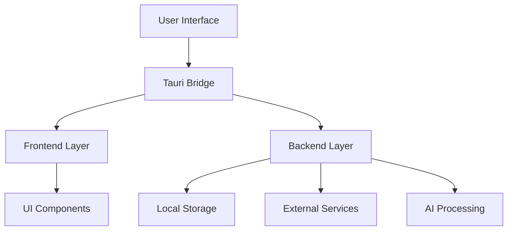
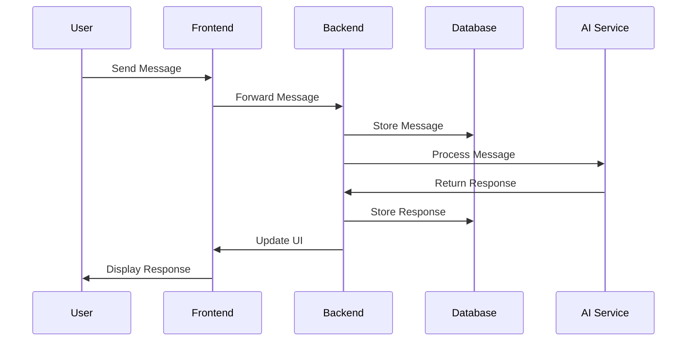

# Software Design Document (SDD)

## Document Control
- **Document Title:** Software Design Document
- **Document Version:** 1.0.0
- **Date:** 2025-02-14
- **Status:** Draft
- **Author:** Cascade AI

## Table of Contents
1. [Introduction](#introduction)
2. [System Architecture](#system-architecture)
3. [Data Design](#data-design)
4. [Interface Design](#interface-design)
5. [Component Design](#component-design)
6. [Security Design](#security-design)

## 1. Introduction

### 1.1 Purpose
This Software Design Document (SDD) provides the architectural and technical specifications for implementing the Windsurf Tauri Desktop Application.

### 1.2 Scope
This document covers:
- System architecture and components
- Data structures and database design
- Interface specifications
- Security implementation
- Performance considerations

### 1.3 References
- [windsurf-setup.md](./windsurf-setup.md) - Project Specification
- [SRS.md](./SRS.md) - Software Requirements Specification

## 2. System Architecture

### 2.1 High-Level Architecture


### 2.2 Component Overview

#### 2.2.1 Frontend Layer (Next.js)
- **UI Components**
  - Login Screen
  - Agent List
  - Chat Windows
  - Settings Panel
- **State Management**
  - Zustand stores
  - React Query cache
- **API Integration**
  - Tauri commands
  - External API clients

#### 2.2.2 Backend Layer (Rust)
- **Core Services**
  - Authentication
  - Message handling
  - File operations
  - Local AI inference
- **External Integrations**
  - AI model APIs
  - CRM systems
  - Analytics services

### 2.3 Technology Stack

#### 2.3.1 Frontend Technologies
- **Framework:** Next.js 14+
- **Language:** TypeScript 5+
- **UI Libraries:**
  - Tailwind CSS
  - shadcn/ui
  - Framer Motion
- **State Management:**
  - Zustand
  - TanStack Query
- **Testing:**
  - Vitest
  - Playwright

#### 2.3.2 Backend Technologies
- **Framework:** Tauri
- **Language:** Rust
- **Libraries:**
  - tokio
  - serde
  - reqwest
  - sqlx/rusqlite
  - ring
- **Testing:**
  - tokio-test
  - mockall

## 3. Data Design

### 3.1 Database Schema

#### 3.1.1 Users Table
```sql
CREATE TABLE users (
    id UUID PRIMARY KEY,
    username VARCHAR(50) UNIQUE NOT NULL,
    password_hash VARCHAR(255) NOT NULL,
    created_at TIMESTAMP NOT NULL,
    last_login TIMESTAMP
);
```

#### 3.1.2 Agents Table
```sql
CREATE TABLE agents (
    id UUID PRIMARY KEY,
    name VARCHAR(100) NOT NULL,
    category VARCHAR(50) NOT NULL,
    status VARCHAR(20) NOT NULL,
    capabilities JSONB,
    created_at TIMESTAMP NOT NULL
);
```

#### 3.1.3 Messages Table
```sql
CREATE TABLE messages (
    id UUID PRIMARY KEY,
    user_id UUID REFERENCES users(id),
    agent_id UUID REFERENCES agents(id),
    content TEXT NOT NULL,
    timestamp TIMESTAMP NOT NULL,
    metadata JSONB
);
```

### 3.2 Data Flow

#### 3.2.1 Message Processing


## 4. Interface Design

### 4.1 User Interface Components

#### 4.1.1 Login Screen
```typescript
interface LoginScreenProps {
    onLogin: (credentials: Credentials) => Promise<void>;
    onForgotPassword: () => void;
}

interface Credentials {
    username: string;
    password: string;
    rememberMe: boolean;
}
```

#### 4.1.2 Agent List
```typescript
interface AgentListProps {
    agents: Agent[];
    onAgentSelect: (agent: Agent) => void;
    onStatusFilter: (status: AgentStatus) => void;
}

interface Agent {
    id: string;
    name: string;
    status: AgentStatus;
    category: string;
    lastActive: Date;
}
```

#### 4.1.3 Chat Window
```typescript
interface ChatWindowProps {
    agent: Agent;
    messages: Message[];
    onSendMessage: (content: string) => Promise<void>;
    onAttachFile: (file: File) => Promise<void>;
}

interface Message {
    id: string;
    content: string;
    sender: string;
    timestamp: Date;
    attachments?: Attachment[];
}
```

### 4.2 API Interfaces

#### 4.2.1 Authentication API
```rust
pub trait AuthService {
    async fn login(&self, credentials: Credentials) -> Result<Session, AuthError>;
    async fn logout(&self, session_id: String) -> Result<(), AuthError>;
    async fn refresh_token(&self, refresh_token: String) -> Result<Session, AuthError>;
}
```

#### 4.2.2 Message API
```rust
pub trait MessageService {
    async fn send_message(&self, message: Message) -> Result<Message, MessageError>;
    async fn get_history(&self, chat_id: String) -> Result<Vec<Message>, MessageError>;
    async fn mark_as_read(&self, message_id: String) -> Result<(), MessageError>;
}
```

## 5. Component Design

### 5.1 Frontend Components

#### 5.1.1 State Management
```typescript
interface AppState {
    user: User | null;
    activeAgent: Agent | null;
    agents: Agent[];
    messages: Record<string, Message[]>;
    settings: AppSettings;
}

const useStore = create<AppState>((set) => ({
    user: null,
    activeAgent: null,
    agents: [],
    messages: {},
    settings: defaultSettings,
}));
```

#### 5.1.2 API Client
```typescript
class ApiClient {
    constructor(private baseUrl: string) {}

    async login(credentials: Credentials): Promise<Session>;
    async getAgents(): Promise<Agent[]>;
    async sendMessage(message: Message): Promise<Message>;
}
```

### 5.2 Backend Components

#### 5.2.1 Database Access
```rust
pub struct Database {
    pool: Pool<Sqlite>,
}

impl Database {
    pub async fn new(url: &str) -> Result<Self, DbError>;
    pub async fn get_user(&self, id: Uuid) -> Result<User, DbError>;
    pub async fn save_message(&self, message: Message) -> Result<(), DbError>;
}
```

#### 5.2.2 AI Service
```rust
pub struct AiService {
    model: Box<dyn Model>,
    cache: Cache,
}

impl AiService {
    pub async fn process_message(&self, content: String) -> Result<String, AiError>;
    pub async fn get_embedding(&self, text: String) -> Result<Vec<f32>, AiError>;
}
```

## 6. Security Design

### 6.1 Authentication Flow
1. **Password Hashing**
   ```rust
   use argon2::{self, Config};

   fn hash_password(password: &str) -> Result<String, ArgonError> {
       let config = Config::default();
       argon2::hash_encoded(password.as_bytes(), salt, &config)
   }
   ```

2. **Token Management**
   ```rust
   #[derive(Debug, Serialize, Deserialize)]
   pub struct Token {
       pub access_token: String,
       pub refresh_token: String,
       pub expires_at: DateTime<Utc>,
   }
   ```

### 6.2 Data Encryption
1. **At Rest**
   ```rust
   use ring::aead::{self, Aad, Nonce, CHACHA20_POLY1305};

   pub struct Encryption {
       key: aead::LessSafeKey,
   }
   ```

2. **In Transit**
   ```rust
   use rustls::{ClientConfig, ServerConfig};

   pub fn create_tls_config() -> Result<ClientConfig, TlsError>;
   ```

### 6.3 Access Control
```rust
#[derive(Debug, Clone)]
pub enum Permission {
    Read,
    Write,
    Admin,
}

pub struct AccessControl {
    pub fn check_permission(user: &User, resource: &Resource, permission: Permission) -> bool;
}
```
