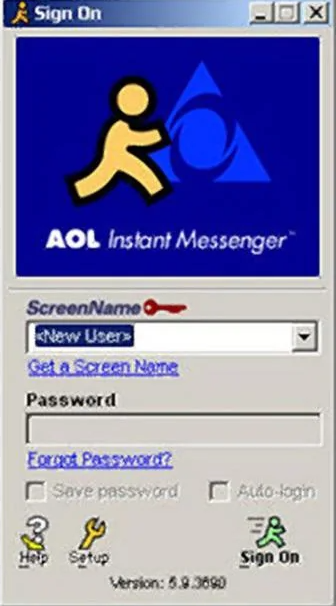
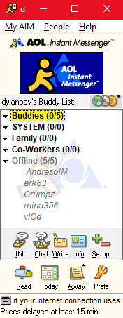
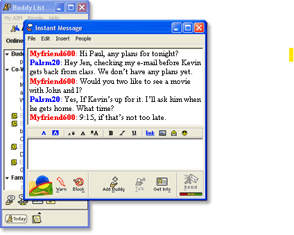

# Design Assets Overview

This document provides an overview of the design assets for the Tauri Desktop Application. These assets serve as visual references for implementing the AIM-inspired UI/UX specified in the project requirements.

## Asset Directory Structure

```
docs/
└── designs/
    └── assets/
        ├── AIM_Login_Screen.png
        ├── AIM_Contact_List.png
        └── AIM_Chat_Window.png
```

## Available Assets

### AIM Login Screen



**Filename**: `AIM_Login_Screen.png`  
**File Size**: 224,291 bytes  
**Dimensions**: 489x488 pixels  
**Last Modified**: 2025-02-17

**Purpose**:
- Reference for implementing the application login screen
- Visual guide for styling form elements
- Example of brand positioning and layout

**Implementation Notes**:
- Adapt this classic design to include MCP connection indicators
- Maintain minimalist approach while adding modern security features
- Preserve nostalgic feel while ensuring accessibility

**Related Requirements**: 
- REQ-UI-001: Login screen must follow AIM-inspired design
- REQ-SEC-003: Authentication must be secure and clear to users

---

### AIM Contact List / Buddy List



**Filename**: `AIM_Contact_List.png`  
**File Size**: 31,522 bytes  
**Dimensions**: 202x445 pixels  
**Last Modified**: 2025-02-17

**Purpose**:
- Reference for implementing the main application window
- Example of contact/buddy list organization
- Visual guide for status indicators and grouping

**Implementation Notes**:
- Adapt to show AI agent statuses and categories
- Include server health indicators
- Maintain collapsible sections for organization
- Preserve the compact layout while ensuring accessibility

**Related Requirements**:
- REQ-UI-002: Main interface must organize agents in a buddy-list style
- REQ-MCP-004: MCP connection status must be clearly visible to users

---

### AIM Chat Window



**Filename**: `AIM_Chat_Window.png`  
**File Size**: 34,328 bytes  
**Dimensions**: 375x348 pixels  
**Last Modified**: 2025-02-17

**Purpose**:
- Reference for implementing the chat interface
- Example of message layout and styling
- Guide for input area and control placement

**Implementation Notes**:
- Adapt to show AI tools and resource usage inline
- Include typing indicators for AI responses
- Add support for prompt management features
- Preserve timestamp and message flow while adding modern features

**Related Requirements**:
- REQ-UI-003: Chat interface must follow AIM-inspired design
- REQ-MCP-005: Active MCP tools and resources must be visible to users

---

## Design Guidelines

When implementing these designs, follow these principles:

1. **Nostalgic Yet Modern**:
   - Maintain the nostalgic feel of AIM
   - Incorporate modern UI patterns where appropriate
   - Ensure accessibility compliance

2. **Consistent Visual Language**:
   - Use consistent colors, fonts, and spacing
   - Maintain proportional sizing across components
   - Preserve the distinct AIM look and feel

3. **Adaptive Layout**:
   - Components should resize appropriately for different screen sizes
   - Maintain the compact nature of the original design
   - Support both light and dark themes

4. **Branding Integration**:
   - Incorporate project branding elements tastefully
   - Maintain the essence of AIM while establishing unique identity
   - Use brand colors as accents within the nostalgic framework

5. **MCP Integration**:
   - Clearly indicate MCP connection status
   - Show active AI tools in a non-intrusive manner
   - Provide visual feedback for AI processing states

## Implementation Resources

- Font recommendation: Use system fonts with a fallback to Lucida Grande or Arial
- Color palette: Sample from the original AIM assets for authenticity
- Spacing: Follow the compact spacing of the original designs
- Modern equivalents: Consider shadcn/ui components styled to match AIM aesthetics

## Version History

| Version | Date | Description | Author |
|---------|------|-------------|--------|
| 0.1.0 | 2025-02-28 | Initial document creation | Design Team |

---

*These assets will be supplemented with additional design guidelines as the project progresses.*