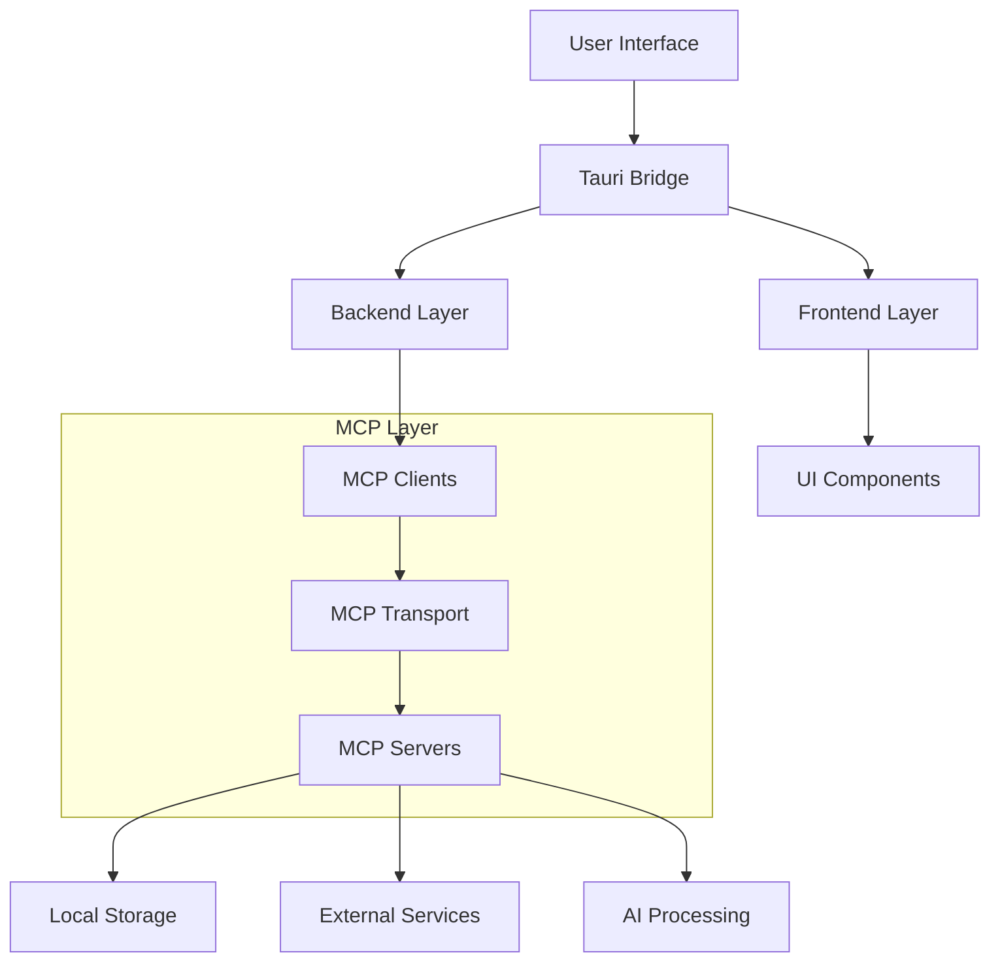
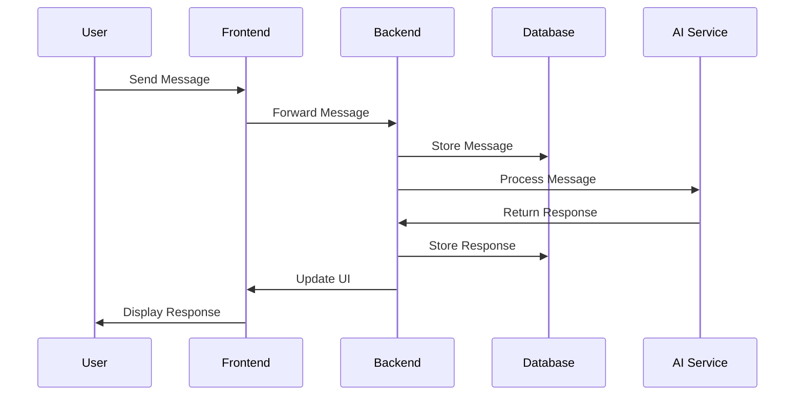

# Software Design Document (SDD)

## Document Control
- **Document Title:** Software Design Document
- **Document Version:** 1.0.0
- **Date:** 2025-02-14
- **Status:** Draft
- **Author:** Cascade AI

## Table of Contents
1. [Introduction](#introduction)
2. [System Architecture](#system-architecture)
3. [Data Design](#data-design)
4. [Interface Design](#interface-design)
5. [Component Design](#component-design)
6. [Security Design](#security-design)

## 1. Introduction

### 1.1 Purpose
This Software Design Document (SDD) provides the architectural and technical specifications for implementing the Windsurf Tauri Desktop Application with MCP integration.

### 1.2 Scope
This document covers:
- System architecture and components
- Data structures and database design
- Interface specifications
- Security implementation
- Performance considerations

### 1.3 References
- [windsurf-setup.md](./windsurf-setup.md) - Project Specification
- [SRS.md](./SRS.md) - Software Requirements Specification

## 2. System Architecture

### 2.1 High-Level Architecture


### 2.2 Component Overview

#### 2.2.1 Frontend Layer (Next.js)
- **UI Components**
  - Login Screen
  - Agent List
  - Chat Windows
  - Settings Panel
- **State Management**
  - Zustand stores
  - React Query cache
  - MCP client state
- **API Integration**
  - Tauri commands
  - MCP client operations
  - Resource access
  - Tool execution

#### 2.2.2 Backend Layer (Rust)
- **Core Services**
  - Authentication
  - Message handling
  - Resource management
  - Tool execution system
- **MCP Integration**
  - Server implementations
  - Resource providers
  - Tool providers
  - Transport handlers
- **External Integrations**
  - AI model APIs via MCP
  - CRM systems as resources
  - Analytics services

#### 2.2.3 MCP Layer
- **Client Components**
  - Client lifecycle management
  - Server connection handling
  - Resource access
  - Tool execution
  - Prompt management
- **Server Components**
  - Resource registration
  - Tool registration
  - Prompt system
  - Context management
- **Transport Layer**
  - SSE transport
  - Stdio transport
  - Custom transports

### 2.3 Technology Stack

#### 2.3.1 Frontend Technologies
- **Framework:** Next.js 14+
- **Language:** TypeScript 5+
- **UI Libraries:**
  - Tailwind CSS
  - shadcn/ui
  - Framer Motion
- **State Management:**
  - Zustand
  - TanStack Query
- **Testing:**
  - Vitest
  - Playwright

#### 2.3.2 Backend Technologies
- **Framework:** Tauri
- **Language:** Rust
- **Libraries:**
  - tokio
  - serde
  - reqwest
  - sqlx/rusqlite
  - ring
  - @modelcontextprotocol/sdk
  - mcp-core
- **Testing:**
  - tokio-test
  - mockall
  - mcp-test-utils
  - mcp-mock-server

#### 2.3.3 MCP Technologies
- **Core SDK:** @modelcontextprotocol/sdk
- **Client Libraries:**
  - mcp-client
  - mcp-transport
  - mcp-resources
- **Server Libraries:**
  - mcp-server
  - mcp-tools
  - mcp-prompts
- **Testing:**
  - mcp-test-utils
  - mcp-mock-server

## 3. Data Design

### 3.1 Database Schema

#### 3.1.1 Users Table
```sql
CREATE TABLE users (
    id UUID PRIMARY KEY,
    username VARCHAR(50) UNIQUE NOT NULL,
    password_hash VARCHAR(255) NOT NULL,
    created_at TIMESTAMP NOT NULL,
    last_login TIMESTAMP
);
```

#### 3.1.2 Agents Table
```sql
CREATE TABLE agents (
    id UUID PRIMARY KEY,
    name VARCHAR(100) NOT NULL,
    category VARCHAR(50) NOT NULL,
    status VARCHAR(20) NOT NULL,
    capabilities JSONB,
    created_at TIMESTAMP NOT NULL
);
```

#### 3.1.3 Messages Table
```sql
CREATE TABLE messages (
    id UUID PRIMARY KEY,
    user_id UUID REFERENCES users(id),
    agent_id UUID REFERENCES agents(id),
    content TEXT NOT NULL,
    timestamp TIMESTAMP NOT NULL,
    metadata JSONB
);
```

### 3.2 Data Flow

#### 3.2.1 Message Processing


## 4. Interface Design

### 4.1 User Interface Components

#### 4.1.1 Login Screen
```typescript
interface LoginScreenProps {
    onLogin: (credentials: Credentials) => Promise<void>;
    onForgotPassword: () => void;
}

interface Credentials {
    username: string;
    password: string;
    rememberMe: boolean;
}
```

#### 4.1.2 Agent List
```typescript
interface AgentListProps {
    agents: Agent[];
    onAgentSelect: (agent: Agent) => void;
    onStatusFilter: (status: AgentStatus) => void;
    mcpServers: MCPServer[];
    onServerSelect: (server: MCPServer) => void;
}

interface Agent {
    id: string;
    name: string;
    status: AgentStatus;
    category: string;
    lastActive: Date;
    mcpCapabilities: MCPCapabilities;
    availableTools: Tool[];
}
```

#### 4.1.3 Chat Window
```typescript
interface ChatWindowProps {
    agent: Agent;
    messages: Message[];
    onSendMessage: (content: string) => Promise<void>;
    onExecuteTool: (tool: Tool, params: unknown) => Promise<void>;
    onAccessResource: (uri: string) => Promise<Resource>;
    availableTools: Tool[];
    availableResources: Resource[];
}

interface Message {
    id: string;
    content: string;
    sender: string;
    timestamp: Date;
    toolExecution?: ToolExecution;
    resources?: Resource[];
}
```

### 4.2 API Interfaces

#### 4.2.1 MCP Client Interface
```rust
pub trait MCPClient {
    async fn connect(&self, transport: Box<dyn Transport>) -> Result<(), MCPError>;
    async fn execute_tool(&self, request: ToolRequest) -> Result<ToolResponse, MCPError>;
    async fn access_resource(&self, uri: String) -> Result<Resource, MCPError>;
    async fn list_capabilities(&self) -> Result<Capabilities, MCPError>;
}
```

#### 4.2.2 MCP Server Interface
```rust
pub trait MCPServer {
    async fn register_tool(&mut self, tool: Tool) -> Result<(), MCPError>;
    async fn register_resource(&mut self, resource: Resource) -> Result<(), MCPError>;
    async fn handle_request(&self, request: Request) -> Result<Response, MCPError>;
}
```

#### 4.2.3 Resource Provider Interface
```rust
pub trait ResourceProvider {
    async fn list(&self) -> Result<Vec<Resource>, MCPError>;
    async fn get(&self, uri: String) -> Result<ResourceContent, MCPError>;
    async fn watch(&self, uri: String) -> Result<ResourceWatcher, MCPError>;
}
```

## 5. Component Design

### 5.1 Frontend Components

#### 5.1.1 State Management
```typescript
interface AppState {
    user: User | null;
    activeAgent: Agent | null;
    agents: Agent[];
    messages: Record<string, Message[]>;
    settings: AppSettings;
    mcp: {
        clients: MCPClient[];
        servers: MCPServer[];
        resources: Resource[];
        tools: Tool[];
    };
}
```

#### 5.1.2 MCP Client Manager
```typescript
class MCPClientManager {
    constructor(private transport: Transport) {}

    async initializeClient(config: MCPClientConfig): Promise<MCPClient>;
    async connectToServer(client: MCPClient, server: MCPServer): Promise<void>;
    async executeToolRequest(request: ToolRequest): Promise<ToolResponse>;
    async accessResource(uri: string): Promise<Resource>;
}
```

### 5.2 Backend Components

#### 5.2.1 MCP Server Implementation
```rust
pub struct MCPServerImpl {
    name: String,
    version: String,
    tools: HashMap<String, Tool>,
    resources: HashMap<String, Resource>,
    prompts: HashMap<String, Prompt>,
}

impl MCPServer for MCPServerImpl {
    async fn register_tool(&mut self, tool: Tool) -> Result<(), MCPError>;
    async fn register_resource(&mut self, resource: Resource) -> Result<(), MCPError>;
    async fn handle_request(&self, request: Request) -> Result<Response, MCPError>;
}
```

#### 5.2.2 Resource Manager
```rust
pub struct ResourceManager {
    providers: Vec<Box<dyn ResourceProvider>>,
    cache: Cache,
}

impl ResourceManager {
    pub async fn get_resource(&self, uri: String) -> Result<Resource, ResourceError>;
    pub async fn list_resources(&self) -> Result<Vec<Resource>, ResourceError>;
    pub async fn watch_resource(&self, uri: String) -> Result<ResourceWatcher, ResourceError>;
}
```

## 6. Security Design

### 6.1 Authentication Flow
1. **Password Hashing**
   ```rust
   use argon2::{self, Config};

   fn hash_password(password: &str) -> Result<String, ArgonError> {
       let config = Config::default();
       argon2::hash_encoded(password.as_bytes(), salt, &config)
   }
   ```

2. **Token Management**
```rust
pub struct MCPServerAuth {
    pub fn authenticate_client(&self, client: &MCPClient) -> Result<(), AuthError>;
    pub fn verify_capabilities(&self, capabilities: &Capabilities) -> Result<(), AuthError>;
}
```

2. **Resource Access Control**
```rust
pub struct MCPAccessControl {
    pub fn check_resource_access(&self, client: &MCPClient, uri: &str) -> Result<(), AccessError>;
    pub fn validate_tool_execution(&self, client: &MCPClient, tool: &Tool) -> Result<(), AccessError>;
}
```

3. **Tool Execution Security**
```rust
pub struct ToolSandbox {
    pub fn create_execution_environment(&self) -> Result<Environment, SandboxError>;
    pub fn validate_parameters(&self, params: &Value) -> Result<(), ValidationError>;
    pub fn cleanup_environment(&self, env: Environment) -> Result<(), CleanupError>;
}
