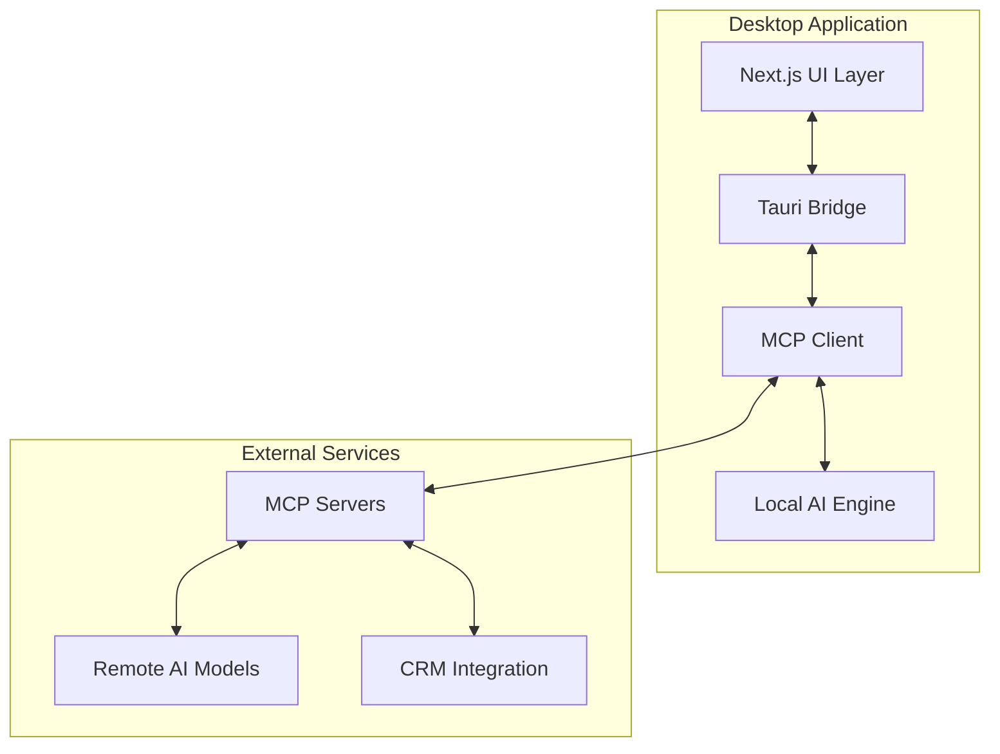

@plan "Define and refine the development approach for Tauri v2, AIM-inspired desktop application with MCP integration"
<!-- cascade-run:
  - lint-check
  - style-guide
  - vulnerability-scan
-->

# Software Development Plan (SDP)

## Document Control
- **Document Title:** Software Development Plan
- **Document Version:** 1.3.0
- **Date:** 2025-02-18
- **Status:** Draft
- **Author:** Preston Sparks

## Table of Contents
1. [Introduction](#introduction)  
2. [Project Organization](#project-organization)  
3. [Management Process](#management-process)  
4. [Technical Process](#technical-process)  
5. [Supporting Process](#supporting-process)  
6. [Documentation Plan](#documentation-plan)

---

## 1. Introduction

### 1.1 Purpose
@validate "Ensure alignment with Tauri v2, AIM-inspired UI/UX, and MCP integration requirements"

This **Software Development Plan (SDP)** outlines the development approach for a **cross-platform desktop application** built on **Tauri v2** with an **AIM-inspired** UI/UX, and **multi-model AI integration** via the **Model Context Protocol (MCP)**. 

### 1.2 Scope
This plan covers:
- Cross-platform deployment (Windows, macOS, Linux)  
- **Local** AI inference (Rust-based ONNX or NLP)  
- **Remote** AI model integration via MCP  
- Tauri v2’s **ACL-based** security  
- AIM-inspired UI, real-time chat workflows  
- Testing, QA, and deployment procedures

### 1.3 References
- [project-overview.md](../project-overview.md) - Main Project Specification  
- [SDD.md](./SDD.md) - Software Design Document  
- [cascade-guidelines.md](../../.codeium/windsurf/cascade-guidelines.md) - AI Documentation & Workflow Guidelines  

---

## 2. Project Organization

### 2.1 Project Structure
@enforce "Maintain consistent directory structure and naming conventions"

```plaintext
quickbots-desktop-app/
├── apps/
│   └── frontend/         # Next.js (output: 'export'), AIM-inspired UI
│       ├── components/   # React components
│       ├── lib/
│       │   └── mcp.ts    # MCP client calls
│       ├── styles/       # CSS/Tailwind
│       └── pages/        # Next.js pages
├── src-tauri/
│   ├── src/
│   │   ├── commands/     # Tauri commands
│   │   ├── mcp/          # MCP server(s), resource management
│   │   ├── security/     # ACL, encryption, credential vault
│   │   ├── ai/           # Local AI integration
│   │   └── main.rs       # Tauri entry point
│   └── Cargo.toml
├── docs/                 # Documentation
├── tests/                # Test suites, E2E, integration
└── .windsurfrules        # Cascade AI rules, memory config
```

### 2.2 Roles and Responsibilities
@enforce "Define clear role boundaries and responsibilities"

- **Development Team**: Implements Tauri commands, Next.js UI, and MCP logic  
- **MCP Specialist**: Oversees AI integration (local + remote), ensures protocol compliance  
- **Security Engineer**: Maintains Tauri ACL, encryption, compliance checks  
- **UI/UX Designer**: Crafts AIM-like layouts, status indicators, chat flows  
- **QA Team**: Executes test plans (unit, integration, E2E), verifies security  
- **DevOps**: CI/CD pipelines, cross-platform builds, release packaging

---

## 3. Management Process

### 3.1 Implementation Phases
@phase "Implement Tauri v2.1.0 + Next.js 14.1.0 + MCP v1.3.0-rc2 in sequential phases"

1. **Foundation Phase**  
   - Initialize Tauri v2.1.0 + Next.js 14.1.0 (static export)  
   - Add `mcp_rust_sdk v1.3.0-rc2` to Cargo.toml  
   - Create minimal "Hello MCP" command  
   - Basic AIM-style UI scaffolding (login screen, buddy list layout)

2. **Core Features Phase**  
   - Implement local AI commands (e.g., ONNX-based text analysis)  
   - Expand buddy list to show agent statuses via MCP v1.3.0-rc2  
   - UI QA: Validate AIM styling against design references:
     - Login screen layout (`docs/designs/assets/AIM_Login_Screen.png`)
     - Buddy list components (`docs/designs/assets/AIM_Contact_List.png`)
     - Chat window design (`docs/designs/assets/AIM_Chat_Window.png`)
   - Integrate Tauri v2.1.0 ACL for security  
   - Store user preferences or settings with `tauri-plugin-store ^0.1.0`
   - Begin tracking success metrics:
     - CRM interaction time baselines
     - Task completion rates
     - Error frequency monitoring

3. **AI Integration Phase**  
   - Connect to external AI models (OpenAI, Anthropic, etc.) via MCP  
   - Context management system (session-based)  
   - Resource discovery and tool execution  
   - "Chat Window" with multi-model support
   - Implement resource sandboxing for local AI tools
   - Security hardening:
     - Encryption standards (ring, AES-based)
     - Tauri v2 ACL refinement
     - Audit logging setup

4. **Security Implementation & Optimization Phase**  
   - Advanced security features:
     - Multi-factor authentication
     - Enhanced encryption protocols
     - Extended ACL policies
   - Resource usage optimization
   - Performance profiling
   - Comprehensive security audits

5. **Testing & Optimization Phase**  
   - Cross-platform E2E tests (Playwright, mcp-mock-server)  
   - Performance profiling with criterion, flamegraphs  
   - Security auditing (cargo-audit, OWASP ZAP)  
   - UI/UX refinement (buddy list usability checks)
   - **Success Metrics & KPIs**:
     - Measure CRM interaction time reduction
     - Track task completion rates vs. baselines
     - Analyze error rates and user satisfaction
     - Document performance improvements

6. **Deployment Phase**  
   - Build + packaging for Windows, macOS, Linux  
   - Documentation finalization  
   - Automated updates (tauri-plugin-updater)  
   - Production readiness checks
   - Final success metrics report:
     - Compile all KPI measurements
     - Generate user satisfaction analysis
     - Document performance benchmarks
     - Prepare metrics dashboard for stakeholders

### 3.2 Risk Management
@validate "Identify and mitigate potential risks promptly"

1. **Technical Risks**  
   - Tauri v2 updates or API changes  
   - Complex MCP usage (multiple AI models)  
   - Cross-platform UI inconsistencies  
   - Resource usage for large AI workloads

2. **Mitigation Strategies**  
   - Pin Tauri v2 versions or track release notes  
   - Gradual MCP expansions, frequent testing  
   - Regular cross-platform checks (macOS, Windows, Linux)  
   - Caching or streaming for heavy AI tasks

---

## 4. Technical Process

### 4.1 Development Environment
@enforce "Standardize on rust-analyzer, Node.js LTS, Tauri CLI"

- **VS Code** with:
  - Tauri extension  
  - rust-analyzer  
  - ESLint + Prettier  
- **Rust** stable toolchain  
- **Node.js** LTS (for Next.js)  
- **Docker** or VMs for multi-OS testing  
- **MCP Dev Kit** (mcp_rust_sdk, mcp-mock-server, etc.)

### 4.2 Development Standards
@enforce "Apply code formatting, security scanning, and AI-friendly structure"

1. **Frontend Stack**
   - Next.js with static export
   - Tailwind CSS + shadcn/ui for styling
   - Zustand for state management
   - Framer Motion for AIM-style animations
   - TypeScript in strict mode

2. **Backend Stack**
   - Rust with tokio async runtime
   - sqlx for SQLite database (local storage)
   - sled for fast key-value caching
   - reqwest for external API calls
   - mcp_rust_sdk for AI integration

3. **Transport Layer**
   - SSE for real-time updates
   - WebSocket for bidirectional chat
   - stdio for local process communication
   - HTTP/2 for REST endpoints

4. **Testing Tools**
   - Frontend:
     - Vitest for unit/integration
     - Playwright for E2E
     - React Testing Library
   - Backend:
     - tokio-test for async
     - mockall for mocking
     - criterion for benchmarks
   - Protocol:
     - mcp-mock-server
     - MCP Test Utils

5. **Success Metrics**
   Specific targets aligned with project goals:
   - CRM interaction time reduction: 30% minimum
   - Task completion rate increase: 25% target
   - Error frequency reduction: 50% target
   - User satisfaction score: 4.5/5.0 minimum
   - System response time: <100ms for 95th percentile
   - AI context retention: 90% accuracy in extended sessions

### 4.3 Quality Assurance
@enforce "Implement comprehensive QA processes"

#### 4.3.1 Code Quality Gates
```yaml
quality_gates:
  test_coverage:
    minimum: 80%
    critical_paths: 90%
  security:
    vulnerability_threshold: 'high'
    required_scans:
      - OWASP Top 10
      - GDPR Compliance
      - MCP Security
  performance:
    ui_response: '<100ms'
    ai_response: '<2s'
    memory_usage: '<200MB'
```

#### 4.3.2 Review Process
1. **AI Pre-Check**:
   ```yaml
   cascade-run:
     - lint-check
     - vulnerability-scan
     - style-guide
   ```

2. **Human Review**:
   - Staff engineer review (2hr SLA)
   - Security review for ACL changes
   - UI/UX review for frontend changes

3. **Automated Validation**:
   - CI/CD pipeline checks
   - Performance regression tests
   - Cross-platform verification

#### 4.3.3 Error Handling Protocol
| Severity | Response Time | Action | Escalation |
|----------|---------------|--------|------------|
| Critical | Immediate | System halt, alert | Senior team |
| High | <1 hour | Graceful degradation | Team lead |
| Medium | <1 day | Log and track | Developer |
| Low | Next release | Document | None |

### 4.4 Monitoring & Observability
@enforce "Implement comprehensive monitoring"

1. **Application Monitoring**:
   - Sentry for error tracking
   - OpenTelemetry for tracing
   - Custom MCP telemetry
   - Health check endpoints

2. **Infrastructure Metrics**:
   - Prometheus collectors
   - Grafana dashboards
   - Resource utilization
   - Network metrics

3. **Business Metrics**:
   - User engagement
   - AI model performance
   - Error rates
   - Response times

4. **Logging Strategy**:
   ```typescript
   interface AppLog {
     timestamp: string;
     level: LogLevel;
     component: Component;
     event: string;
     context: {
       user?: string;
       session: string;
       trace: string;
     };
     metadata: Record<string, unknown>;
   }
   ```

### 4.5 Compliance & Security
@enforce "gdpr-2025"

1. **Data Protection**:
   - Encryption at rest (AES-256)
   - Secure transport (TLS 1.3)
   - Key rotation (30 days)

2. **Access Control**:
   - Role-based permissions
   - Resource-level ACL
   - Session management

3. **Audit Requirements**:
   - Weekly security scans
   - Access log retention
   - Incident response

4. **GDPR Compliance**:
   - Data minimization
   - Right to erasure
   - Consent tracking
   - Cross-border handling

### 4.6 Implementation Standards
@enforce "Maintain consistent implementation patterns"

#### 4.6.1 Development Workflow
```yaml
workflow:
  feature:
    - Create feature branch
    - Implement with TDD
    - Run local tests
    - AI pre-check
    - Create PR
  bugfix:
    - Reproduce with test
    - Fix implementation
    - Verify fix
    - Update docs
  release:
    - Version bump
    - Changelog update
    - Security scan
    - Cross-platform test
```

#### 4.6.2 Code Organization
1. **Frontend Structure**:
   ```plaintext
   apps/frontend/
   ├── components/
   │   ├── chat/           # Chat-related components
   │   ├── agents/         # Agent list components
   │   ├── common/         # Shared components
   │   └── layouts/        # Page layouts
   ├── hooks/
   │   ├── useMCP.ts      # MCP interaction hooks
   │   ├── useAgent.ts    # Agent management
   │   └── useAuth.ts     # Authentication
   ├── stores/
   │   ├── auth.ts        # Authentication state
   │   ├── agents.ts      # Agent state
   │   └── ui.ts          # UI preferences
   └── utils/
       ├── mcp/           # MCP utilities
       ├── testing/       # Test helpers
       └── i18n/          # Translations
   ```

2. **Backend Structure**:
   ```plaintext
   src-tauri/src/
   ├── commands/          # Tauri commands
   │   ├── auth.rs       # Auth commands
   │   ├── chat.rs       # Chat commands
   │   └── agents.rs     # Agent commands
   ├── models/           # Domain models
   ├── services/         # Business logic
   └── utils/           # Shared utilities
   ```

#### 4.6.3 Testing Strategy
@enforce "Comprehensive test coverage"

1. **Unit Tests**:
   ```yaml
   coverage_requirements:
     commands: 90%
     services: 85%
     models: 80%
     utils: 75%
   
   test_patterns:
     - "**/*.test.ts"     # Frontend tests
     - "**/*_test.rs"     # Backend tests
   ```

2. **Integration Tests**:
   ```yaml
   integration_suites:
     mcp:
       - Resource discovery
       - Context management
       - Tool execution
     ui:
       - Chat flows
       - Agent interactions
       - Settings management
   ```

3. **E2E Testing**:
   ```yaml
   e2e_scenarios:
     - name: "Full Chat Flow"
       steps:
         - Login
         - Open chat
         - Send message
         - Verify response
     - name: "Agent Management"
       steps:
         - List agents
         - Change status
         - Verify update
   ```

4. **Performance Testing**:
   ```yaml
   performance_suites:
     startup:
       - Cold start time
       - Resource initialization
     runtime:
       - Memory usage
       - CPU utilization
     network:
       - API latency
       - Websocket performance
   ```

5. **Security Testing**:
   ```yaml
   security_checks:
     static:
       - SAST scan
       - Dependency audit
       - License check
     dynamic:
       - DAST scan
       - Penetration test
       - Fuzzing
   ```

### 4.7 MCP Integration Architecture


1. **Bidirectional Communication Flow**:
   - UI ↔ Tauri Bridge: Event-driven IPC
   - Bridge ↔ MCP Client: Secure command channels
   - MCP Client ↔ Services: Encrypted WebSocket/SSE

2. **Resource Management**:
   - Session-based isolation
   - Sandboxed tool execution
   - Strict ACL enforcement

3. **Data Privacy & GDPR Compliance**:
   - Audit logging of all MCP interactions
   - User data encryption at rest
   - Configurable data retention policies
   - Clear data processing documentation
   - User consent management
   - Right to erasure support

### 4.8 Build Process
@enforce "Implement secure build pipeline with AI-friendly triggers"

1. **Development Build**  
   - Next.js dev mode (`npm run dev`)  
   - Tauri dev server (`cargo tauri dev`)  
   - Mock AI or minimal local AI commands  
   - Potential `.retry` steps if build fails

2. **Production Build**  
   - `npm run build && npm run export` for Next.js  
   - `cargo tauri build` for platform binaries  
   - CSP + ACL checks in `tauri.conf.json`  
   - Minimization and code signing (optional)

---

## 5. Supporting Process

### 5.1 Configuration Management
@enforce "Maintain a secure, versioned config for Tauri + MCP + AI"

- **.env files** for secrets (encrypt or store in plugin-store)  
- **Feature Flags** for local AI vs. remote AI toggles  
- **Tauri conf** for whitelisting external endpoints  
- **MCP config** for endpoint URIs, tool definitions, resource scoping

### 5.2 Quality Assurance
@validate "Ensure broad coverage and protocol compliance"

1. **Testing Strategy**  
   - Automated unit + integration tests on each commit  
   - `mcp-mock-server` for multi-model scenario testing  
   - Performance tests with criterion, test concurrency/throughput  
   - Security scans (cargo-audit, npm-audit, OWASP ZAP)
   - Success metrics validation:
     - CRM interaction time reduction
     - Task completion improvement
     - User satisfaction metrics
     - Error rate tracking
   - UI/UX compliance testing:
     - Design reference validation against `docs/designs/assets`
     - AIM aesthetic consistency checks
     - Cross-platform UI behavior verification

2. **Review Process**
```markdown
## Code Review Protocol
1. **Automated Pre-Check**:
   <!-- run:
     - lint-check
     - vulnerability-scan
     - style-guide
     - design-check
     - schedule-realignment
     - metric-check
     - design-assets-check
   -->
   - Automated documentation linting
   - Security vulnerability scanning
   - Style guide compliance checks
   - AIM UI test case validation
   - Security task scheduling verification
   - Success metrics tracking validation
   - Design reference compliance checks

2. **Human Review**:
   - Staff engineer or documentation lead review
   - Verify AIM style descriptions and security phasing
   - Confirm success metrics integration
   - Validate design reference usage
   @assign: staff-engineer
   @sla: 2hr

3. **Final Validation**:
   - Confirm all AUDIT REPORT gaps are addressed
   - Verify alignment with project-overview.md
   - Check all design references are properly cited
   - Ensure security measures are properly phased

## Error Handling Protocol (EHP)
| Severity  | Action                          |
|-----------|---------------------------------|
| Critical  | <!-- revert-step --> + @alert   |
| High      | .retry + @senior-review         |
| Medium    | .retry                          |

- **Critical**: Security tasks missing, requires revert and alert
- **High**: Incomplete referencing, requires retry and senior review
- **Medium**: Minor issues, automatic retry
```

---

## 6. Documentation Plan
@enforce "Maintain comprehensive docs with Cascade guidelines"

1. **Technical Documentation**  
   - **API.md**: Tauri commands, MCP endpoints, param schemas  
   - **Security Guidelines**: Tauri ACL usage, encryption approach  
   - **AI Integration**: Steps for local inference + remote AI config  
   - **MCP Implementation**: Tool definitions, resource management, session flow

2. **User Documentation**  
   - **Installation Guide**: Cross-platform instructions  
   - **User Manual**: AIM-inspired chat usage, status indicators, etc.  
   - **Security Best Practices**: Credential handling, ACL, updates  
   - **Troubleshooting**: Common errors, logs, known issues

<!-- cascade-run: vulnerability-scan -->
