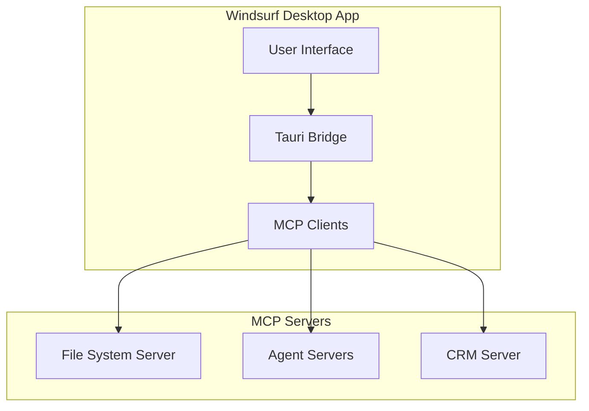

# Tauri Desktop Application Project Specification

This document consolidates the preliminary research and requirements for building a **cross-platform desktop application** using the [Tauri](https://tauri.app/) framework, with a **UI/UX** inspired by **AOL Instant Messenger (AIM)** from the early 2000s. The goal is to provide both **human developers** and the **Windsurf Cascade AI** with a comprehensive blueprint—from architecture and security considerations to design inspiration—enabling rapid, consistent, and secure development.

---

## Table of Contents

1. [Project Overview](#project-overview)  
2. [Key Objectives](#key-objectives)  
3. [UI/UX Inspiration](#uiux-inspiration)  
4. [Core Technologies](#core-technologies)  
   1. [Tauri Framework](#tauri-framework)  
   2. [Backend (Rust)](#backend-rust)  
   3. [Frontend (TypeScript & Next.js)](#frontend-typescript--nextjs)  
   4. [Recommended Tauri Plugins](#recommended-tauri-plugins)  
   5. [Model Context Protocol (MCP)](#model-context-protocol-mcp)  
   6. [MCP Integration](#mcp-integration)  
5. [Developer Tooling & Workflow](#developer-tooling--workflow)  
6. [Best Practices & Architecture Guidelines](#best-practices--architecture-guidelines)  
7. [Implementation Roadmap](#implementation-roadmap)  
8. [Security & Encryption](#security--encryption)  
9. [Future Considerations](#future-considerations)  
10. [Success Metrics](#success-metrics)  
11. [Design Reference Files](#design-reference-files)  
12. [Codeium Windsurf & Cascade AI Integration](#codeium-windsurf--cascade-ai-integration)  
    1. [AI-Optimized Documentation](#ai-optimized-documentation)  
    2. [Memory Configuration & Rules](#memory-configuration--rules)  
    3. [Code Generation & Error Handling Protocols](#code-generation--error-handling-protocols)  
    4. [Review Workflow & Security Manifesto](#review-workflow--security-manifesto)  

---

## 1. Project Overview

This desktop application will integrate **local AI/ML capabilities** while also leveraging **external foundational AI models** through the **Model Context Protocol (MCP)** for enhanced AI integration and context management. The front end and user experience will take cues from **AOL Instant Messenger (AIM)**—focusing on a **lightweight, chat-based** interaction model. This approach suits use cases in which users monitor multiple “agents,” gather real-time updates, and need minimal disruption to their workflow.

**Key highlights**:
- **Cross-platform** support: Windows, macOS, and Linux.  
- **Compact, efficient** user interface based on AIM design principles.  
- **Standardized AI integration** using MCP for consistent context management and tool execution.  
- **Local AI inference** (e.g., ONNX Runtime, Rust NLP libraries) combined with **secure external AI model** usage.  
- Strong emphasis on **security**, including cryptographic standards, data encryption, and compliance with industry regulations.  
- Modular and **future-ready** architecture leveraging MCP’s client-server model.

---

## 2. Key Objectives

1. **Cross-Platform Deployment**  
   Deliver a single Tauri-based desktop application that runs seamlessly across Windows, macOS, and Linux.

2. **Enhanced AI Integration**  
   - **Local Inference:** Ability to run ONNX models or Rust-based NLP for offline tasks.  
   - **MCP Integration:** Standardized communication with AI models using the Model Context Protocol.  
   - **Context Management:** Efficient handling of prompts, resources, and tools through MCP.  
   - **External Models:** Secure and standardized integration with third-party AI services.

3. **Security & Maintainability**  
   - Employ **strong cryptographic standards** for data storage and network communication.  
   - Ensure maintainable code through MCP’s standardized interfaces and Rust’s safety features.  
   - Implement secure resource access and tool execution via MCP’s security model.

4. **Enhanced User Experience**  
   - Provide an **AIM-inspired** interface that is familiar, compact, and easy to navigate.  
   - Offer **real-time updates** for CRM data, AI agent status, and relevant tasks.  
   - Enable **seamless AI interactions** through MCP’s structured communication protocol.

5. **Scalable Architecture**  
   - Establish a clear **Clean Architecture** enhanced by MCP’s client-server model.  
   - Enable easy integration of new AI capabilities through MCP’s extensible design.  
   - Support future expansions through standardized tool and resource management.

---

## 3. UI/UX Inspiration

Drawing on **AOL Instant Messenger (AIM)** of the early 2000s, the application’s interface will follow these guiding principles:

- **Compact Window Layout:** Minimizes screen space usage, allowing users to keep the application running alongside other windows.  
- **Familiar Chat Metaphor:** Real-time “chat” or messaging with AI agents.  
- **Status Indicators:** Each agent’s current state (online, offline, processing, etc.) is immediately visible.  
- **Categorized Agent Lists:** Organize agents into collapsible categories (e.g., “Active Agents,” “CRM Integration,” “System Agents”).  
- **Efficient Navigation:** Quick search/filter for agents, real-time messages, tasks, and deals/pipelines.

### Core Views

1. **Login View**  
   - Username/password fields (with “Forgot Password” and “Save Password” options).  
   - Version info display and user registration link.

2. **Main View (Agent List)**  
   - Collapsible categories grouping AI agents by function or status.  
   - Simple search/filter box for quick agent lookups.  
   - Status indicators (online/offline, active tasks).

3. **Chat View**  
   - Text input area with formatting options (bold, italics, etc.).  
   - Timestamped message history.  
   - Real-time activity indicators.  
   - Optional CRM updates or “task results” displayed inline.

4. **Additional Views**  
   - **Customer List:** Overview of all customer records (if integrated with CRM).  
   - **Deals/Pipeline View:** Track deals or tasks across various stages.  
   - **God View:** High-level dashboard showing system performance metrics, agent logs, and real-time CRM updates.

---

## 4. Core Technologies

### 4.1 Tauri Framework

- **Latest stable version** of Tauri.  
- Allows a secure, lightweight bridge between the desktop environment and a web-based frontend.  
- **Rust-based backend** ensures memory safety and high performance.  
- Smaller binary footprint compared to Electron or similar solutions.

### 4.2 Backend (Rust)

**Recommended Libraries & Tools**:
- **tokio**: Asynchronous runtime.  
- **serde**: Serialization/deserialization.  
- **reqwest**: HTTP client for calling external APIs.  
- **tower-http**: HTTP middleware for potential internal APIs.  
- **tracing**: Logging and diagnostics.  
- **ring**: Cryptographic operations.  
- **@modelcontextprotocol/sdk**: MCP SDK for server/client implementation.  
- **mcp-core**: Core MCP types and utilities.  
- **sqlx** or **rusqlite**: For local SQL database integration.  
- **sled**: Option for an embedded key-value database.

### 4.3 Frontend (TypeScript & Next.js)

- **Next.js** configured with `output: 'export'` for seamless Tauri bundling.  
- **React** as the primary library.  
- **Tailwind CSS**: Utility-first styling approach.  
- **[shadcn/ui](https://ui.shadcn.com/)**: Prebuilt, customizable UI components.  
- **Lucide React**: Iconography library.  
- **Framer Motion**: Animations and transitions.  
- **TanStack Query (React Query)**: Data fetching and caching.  
- **Zustand**: Lightweight global state management.  
- **Zod**: Runtime type validation.  
- **date-fns**: Date utilities for formatting and manipulation.

### 4.4 Recommended Tauri Plugins

1. **tauri-plugin-store**: Persistent storage mechanism for settings or small data sets.  
2. **tauri-plugin-sql**: Facilitates SQLite or other SQL database usage within Tauri.  
3. **tauri-plugin-log**: Centralized logging in production builds.  
4. **tauri-plugin-positioner**: Advanced window positioning for multiple/floating windows.  
5. **tauri-plugin-autostart**: Enables “auto-launch on startup” behavior for user convenience.  
6. **tauri-plugin-updater**: Built-in auto-update workflows to keep your app fresh.

### 4.5 Model Context Protocol (MCP)

#### 4.5.1 Core Components

- **Client Implementation**: MCP client integration for AI agent communication  
- **Server Implementation**: MCP servers for each AI agent type  
- **Transport Layer**: SSE and stdio transport support  
- **Resource Management**: Standardized resource handling  
- **Tool Integration**: Unified tool interface  
- **Prompt System**: Structured prompt management  

#### 4.5.2 Integration Benefits

- Standardized AI model integration  
- Consistent context management  
- Secure resource access  
- Extensible tool system  
- Structured prompt handling  
- Clear communication protocols  

---

## 4.6 MCP Integration

### 4.6.1 Architecture Overview

### 4.6.2 Key Components

1. **MCP Clients**
   - Manages connections to MCP servers
   - Handles resource discovery and access
   - Executes tool operations
   - Manages prompt systems

2. **MCP Servers**
   - File System Server: Local file access
   - Agent Servers: AI agent management
   - CRM Server: CRM data integration

3. **Integration Strategy**
    **Phase 1: Core Setup**
    - MCP client infrastructure
    - Basic server implementation
    - Transport layer setup

    **Phase 2: Feature Integration**
    - Resource system implementation
    - Tool system setup
    - Prompt management

    **Phase 3: Advanced Features**
    - Advanced context management
    - Multi-agent coordination
    - Enhanced security features

### 4.6.3 Security Considerations

#### 4.6.3.1 Authentication & Authorization
- Server authentication
- Client authentication
- Resource access control
- Tool execution permissions

#### 4.6.3.2 Data Protection
- Secure transport layer
- Resource isolation
- Context confidentiality
- Tool sandboxing

#### 4.6.3.3 Compliance
- Audit logging
- Access tracking
- Security scanning
- Regular updates

---

## 5. Developer Tooling & Workflow

### 5.1 IDE & Extensions
- **VS Code** recommended with:
  - **rust-analyzer** (for Rust).
  - **Tauri** (for Tauri-specific tooling).
  - **ESLint** + **Prettier** (for linting/formatting TypeScript).
  - **GitLens** (for enhanced Git insights).
  - **Error Lens** (for real-time error highlighting).

### 5.2 Testing
- **Frontend (TypeScript):**
    - **Vitest**: High-performance unit testing library.
    - **Testing Library**: For React component tests.
    - **Playwright**: End-to-end testing.
    - **MCP Test Utils**: Testing utilities for MCP client integration.

- **Backend (Rust):**
    - **tokio-test**: Async testing support.
    - **mockall**: Mock dependencies for isolated testing.
    - **criterion**: Performance benchmarking.
    - **mcp-mock-server**: Mock MCP server for testing.

### 5.3 CI/CD
- **GitHub Actions**: Continuous integration (CI) pipelines.
- **cargo-release**: Automated Rust release management.
- **semantic-release**: Automated versioning and changelog generation (frontend or combined).
- **Docker**: Containerized builds and environment parity.

### 5.4 Code Quality & Security
- **ESLint** + **Prettier**: Ensures consistent formatting for JS/TS.
- **clippy** + **rustfmt**: Ensures Rust code quality and formatting.
- **cargo-audit** + **cargo-deny**: Checks Rust dependencies for vulnerabilities or licensing issues.
- **npm-audit**: Checks NPM dependencies for known security flaws.
- **OWASP ZAP**: Automated security scanning tool.
- **MCP Inspector**: Debug and validate MCP protocol compliance.
- **MCP Linter**: Ensure MCP best practices and patterns.

### 5.5 Monitoring & Analytics
- **Sentry**: Error tracking and alerting.
- **OpenTelemetry**: Distributed tracing for performance and debugging.
- **Prometheus & Grafana**: Metrics gathering and visualization.
- **Lighthouse & flamegraph**: Performance audits and analysis (frontend and backend).

---

## 6. Best Practices & Architecture Guidelines

### 6.1 Clean Architecture & Folder Structure
- Organize Rust modules and Next.js pages/features by domain or functionality.
- Maintain separation of concerns (data access, business logic, UI).
- Follow MCP’s recommended project structure for server implementations.

### 6.2 Security-First Mindset
- Enforce strict Content Security Policy (CSP) within Tauri.
- Implement MCP’s security best practices for resource and tool access.
- Regular security audits of MCP server implementations.
- Validate all inputs at both frontend and backend.

### 6.3 Performance Optimization
- Code-splitting, lazy loading, bundling optimizations.
- Leverage Rust’s memory safety and MCP’s efficient protocols.
- Optimize MCP resource access and caching strategies.
- Monitor performance and optimize as codebase grows.

### 6.4 Testing Strategy
- Coverage goals for unit, integration, and E2E.
- Automated runs via GitHub Actions on pull requests.
- Benchmark performance-critical paths with criterion.

### 6.5 Continuous Integration & Delivery
- Build pipelines should include linting, testing, security checks.
- Keep release versions in sync for Rust (cargo-release) and TypeScript (semantic-release).

---

## 7. Implementation Roadmap

### 7.1 Project Initialization
- Create a new Tauri + Rust + Next.js project.
- Install and configure core Tauri plugins.
- Set up MCP SDK and development environment.

### 7.2 Frontend Setup
- Integrate Next.js with output: 'export' for Tauri.
- Configure UI libraries and state management.
- Implement MCP client components and hooks.
- Set up shared components (Navigation, Chat windows, etc.).

### 7.3 Backend & AI Integration
- Implement MCP client infrastructure in Rust.
- Set up MCP servers for different agent types.
- Configure transport layers (SSE, stdio).
- Implement resource and tool management.
- Set up prompt system and context handling.

### 7.4 Security & Data Handling
- Implement MCP’s authentication and authorization.
- Set up secure resource access and isolation.
- Configure tool execution sandboxing.
- Implement audit logging and monitoring.

### 7.5 Testing & QA
- Write unit tests for MCP components.
- Test MCP server implementations.
- Validate protocol compliance.
- End-to-end testing of AI interactions.

### 7.6 Deployment & Updates
- Use tauri-plugin-updater to implement auto-update flows.
- Automate release versions with cargo-release and semantic-release.
- Build and distribute binaries/installers for Windows, macOS, and Linux.

### 7.7 Monitoring & Optimization
- Configure Sentry for error tracking.
- Add optional OpenTelemetry instrumentation for deeper performance insights.
- Refine features and performance based on user feedback and usage metrics.

---

## 8. Security & Encryption

### 8.1 Secure Authentication
- MCP server and client authentication.
- Resource access authorization.
- Tool execution permissions.

### 8.2 Data Protection 
- Secure transport layer (SSE/stdio).
- Resource isolation and access control.
- Context confidentiality.
- Tool execution sandboxing.

### 8.3 Access Control
- MCP-based permission system.
- Resource-level access control.
- Tool execution restrictions.

### 8.4 Audit Logging
- MCP protocol events.
- Resource access tracking.
- Tool execution history.
- Security-relevant events.

---

## 9. Future Considerations

### 9.1 Feature Expansion

- Advanced MCP server implementations.
- Custom tool development.
- Enhanced prompt management.
- Deeper AI model integration.

### 9.2 Customizable Themes

- Theme-aware MCP resources.
- Dynamic UI adaptation.

### 9.3 Modular Plugin System

- MCP-based plugin architecture.
- Custom server implementations.
- Tool extension system.
- Resource type extensions.

### 9.4 Scalability

- Distributed MCP servers.
- Load balancing strategies.
- Resource caching and optimization.
- Enhanced context management.

---

## 10. Success Metrics

### 10.1 Reduced CRM Interaction Time
- Efficient MCP-based data access.
- Streamlined tool execution.
- Optimized resource management.

### 10.2 Improved Task Completion Rates

- Standardized AI integration through MCP.
- Efficient context management.
- Enhanced tool capabilities.

### 10.3 Increased User Satisfaction

- Seamless AI interactions.
- Consistent performance.
- Reliable tool execution.

### 10.4 Decreased Error Rates

- Strong type safety through MCP.
- Validated tool inputs.
- Secure resource access.

### 10.5 Enhanced Productivity

- Efficient context switching.
- Quick tool access.
- Optimized resource usage.

---

## 11. Design Reference Files
To provide Windsurf AI with clear visual guidance for the AOL Instant Messenger–inspired design, we have included three reference images in the repository. 

These images are located in the `windsurf-docs/assets` folder.

1. **AIM_Login_Screen.png**
    - **Purpose**: Illustrates the classic AIM login flow, including screen name/password entry and “Forgot Password” and “Save Password” options.
    - **Usage**: Use this image to replicate a simple, nostalgic login layout and to understand minimal UI elements required.
    - **MCP Integration**: Add subtle indicators for MCP server connection status and available capabilities.

2. **AIM_Contact_List.png**
    - **Purpose**: Shows the compact buddy list interface with collapsible categories and statuS icons.
    - **Usage**: Reference this layout for designing our “Main View” (agent list) with online/offline indicators and collapsible sections.
    - **MCP Integration**:
        - Enhance status indicators to show MCP server health
        - Add visual cues for available tools and resources
        - Include server capability indicators in agent listings

2. **AIM_Chat_Window.png**
    - **Purpose**: Depicts the chat window format with text input area, timestamped messages, and status icons.
    - **Usage**: Use this image as a guide for building the “Chat View,” focusing on message alignment, timestamps, and streamlined user interaction.
    - **MCP Integration**:
        - Add subtle indicators for active tools and resources
        - Include context awareness indicators
        - Show prompt template availability

---
