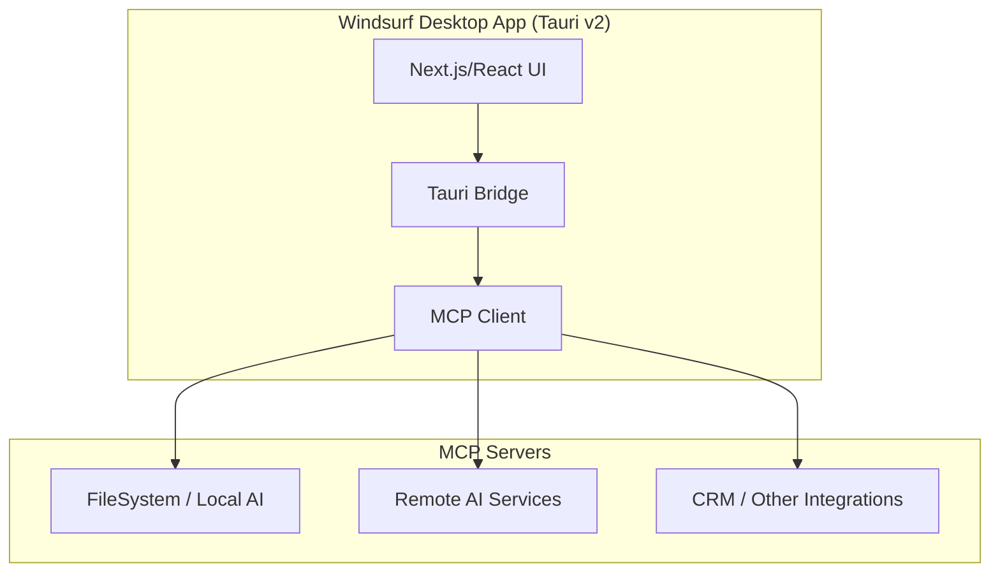

@plan "Tauri v2 + Next.js AIM-Inspired Desktop App"
<!-- cascade-run:
  - lint-check
  - vulnerability-scan
  - style-guide
-->
@enforce "Use Tauri v2 security best practices"
@validate "Ensure consistent architecture with MCP"

# Tauri Desktop Application Project Specification

This document consolidates the **latest research** and requirements for building a **cross-platform desktop application** using **Tauri v2** with a **UI/UX** inspired by **AOL Instant Messenger (AIM)** from the early 2000s. Our approach integrates both **local AI** and **remote AI** via the **Model Context Protocol (MCP)**, ensuring a secure, future-proof architecture. The goal is to provide both **human developers** and **Windsurf Cascade AI** with a cohesive blueprint—from architecture and security considerations to design inspiration—enabling rapid, consistent, and secure development.

---

## Table of Contents

1. [Project Overview](project-overview.md#project-overview)  
2. [Key Objectives](project-overview.md#key-objectives)  
3. [UI/UX Inspiration](project-overview.md#uiux-inspiration)  
4. [Core Technologies](project-overview.md#core-technologies)  
   1. [Tauri Framework](project-overview.md#tauri-framework)  
   2. [Backend (Rust)](project-overview.md#backend-rust)  
   3. [Frontend (TypeScript & Next.js)](project-overview.md#frontend-typescript--nextjs)  
   4. [Recommended Tauri Plugins](project-overview.md#recommended-tauri-plugins)  
   5. [Model Context Protocol (MCP)](project-overview.md#model-context-protocol-mcp)  
   6. [MCP Integration](project-overview.md#mcp-integration)  
5. [Developer Tooling & Workflow](project-overview.md#developer-tooling--workflow)  
6. [Best Practices & Architecture Guidelines](project-overview.md#best-practices--architecture-guidelines)  
7. [Implementation Roadmap](project-overview.md#implementation-roadmap)  
8. [Security & Encryption](project-overview.md#security--encryption)  
9. [Future Considerations](project-overview.md#future-considerations)  
10. [Success Metrics](project-overview.md#success-metrics)  
11. [Design Reference Files](designs/assets)  
12. [Codeium Windsurf & Cascade AI Integration](project-overview.md#codeium-windsurf--cascade-ai-integration)

---

## 1. Project Overview

This application will integrate **local AI/ML capabilities** (via Rust-based ONNX or similar libraries) and **external AI models** through the **Model Context Protocol (MCP)** for robust context management, multi-model usage, and secure resource handling. The front end offers an **AOL Instant Messenger (AIM)-inspired** experience—featuring chat-based interactions, buddy lists, quick status indicators, and minimal disruption to a user’s workflow.

**Key highlights**:
- **Cross-platform**: Windows, macOS, Linux.  
- **Lightweight, chat-based UI** reflecting the AIM style.  
- **Standardized AI integration** using MCP for local/remote model orchestration.  
- **Security** by design, leveraging Tauri v2’s advanced IPC and ACL-based permissions.  
- **Future-ready** with modular expansions, tool chaining, and multi-agent support.  

```markdown
@enforce "TypeScript strict mode"
@validate "MCP-based resource isolation"
```

---

## 2. Key Objectives

1. **Cross-Platform Deployment**  
   Deliver a single Tauri v2–based application running on Windows, macOS, and Linux.  

2. **Enhanced AI Integration**  
   - **Local Inference**: ONNX or Rust-based NLP for offline tasks.  
   - **MCP**: Standardized context management, resource discovery, and tool execution.  
   - **Context Management**: Consistent handling of prompts, ephemeral sessions, and multi-agent chaining.  
   - **External Models**: Secure calls to third-party AI via MCP’s protocol-level sandbox.

3. **Security & Maintainability**  
   - Strong cryptographic standards for data storage/transit.  
   - Tauri v2 ACL for restricting command calls.  
   - MCP-based resource gating and tool sandboxing.  
   - Modular, maintainable architecture.

4. **Enhanced User Experience**  
   - **AIM-inspired** design: Buddy lists, real-time chat, quick agent status checks.  
   - **Realtime Updates** for CRM data and agent outputs.  
   - Seamless bridging of local/remote AI through consistent UI metaphors.

5. **Scalable Architecture**  
   - Clean Architecture approach with Tauri + Next.js + Rust + MCP.  
   - Easy expansions for new AI tools, local or remote.  
   - Standard interfaces for resource management, prompt systems, multi-tenant scenarios.

---

## 3. UI/UX Inspiration

1. **Compact Windows** reminiscent of AIM: minimal space usage, straightforward chat frames.  
2. **Agent or “Buddy” Lists** with status icons for online/offline/processing.  
3. **Instant Chat**: typed messages with optional file attachments, timestamping.  
4. **Additional Views** for CRM records, pipeline tracking, or an admin “God View” for advanced monitoring.

*(Refer to [Design Reference Files](designs/assets) for screenshots.)*

---

## 4. Core Technologies

### 4.1 Tauri Framework

- **Tauri v2**: Emphasizes performance, security (ACL-based).  
- Rust-based backend for memory safety and cross-platform builds.  
- Minimal resource footprint compared to Electron.  

### 4.2 Backend (Rust)

- **tokio** for async runtime.  
- **serde** for JSON serialization.  
- **reqwest** for external calls (if needed).  
- **mcp_rust_sdk** for bridging local or remote AI.  
- **sqlx** / **sled** for local DB or key-value storage.

### 4.3 Frontend (TypeScript & Next.js)

- **Next.js** with `output: 'export'` for static asset bundling.  
- **Tailwind CSS** or **shadcn/ui** for rapid UI layout.  
- **TanStack Query** for data fetching/caching.  
- **Zustand** for global state.  
- **Framer Motion** for animations.

### 4.4 Recommended Tauri Plugins

1. **tauri-plugin-store**: For local credential or settings storage.  
2. **tauri-plugin-sql**: Integrating SQLite.  
3. **tauri-plugin-updater**: Automatic updates.  
4. **tauri-plugin-log**: Centralized logging for dev/production.  

### 4.5 Model Context Protocol (MCP)

#### 4.5.1 Core Components
- **Client** for AI agent communication, resource discovery.  
- **Server** for local AI, remote AI, or filesystem-based resources.  
- **Transport** (SSE, stdio, WebSocket).  
- **Resource System** for tool integration, prompt management, etc.

#### 4.5.2 Integration Benefits
- Standard “tool chaining” for local + remote AI.  
- Session-based context handling with strict isolation.  
- Clear communication protocols for advanced workflows.

---

## 4.6 MCP Integration

### 4.6.1 Architecture Overview



### 4.6.2 Key Components
1. **MCP Clients**: Manage local or remote AI connections, resource usage.  
2. **MCP Servers**: Host AI models or data; could run locally (Rust) or externally.  
3. **Integration Strategy**: Start with minimal “Hello MCP” test, expand to advanced context/prompt systems.

### 4.6.3 Security Considerations

```markdown
@enforce "Follow ACL in tauri.conf.json"
@validate "Restrict local resource writes"
```
1. **Authentication**: Control Tauri commands with ACL.  
2. **Context Confidentiality**: Isolate each user session or agent.  
3. **Compliance**: Use logs for compliance (GDPR, etc.).

---

## 5. Developer Tooling & Workflow

### 5.1 IDE & Extensions
- **VS Code** with rust-analyzer, Tauri plugin, ESLint, Prettier, GitLens, etc.

### 5.2 Testing
- **Vitest**, **Playwright** for TypeScript.  
- **tokio-test**, **mockall**, **mcp-mock-server** for Rust.  
- **MCP Test Utils** for protocol compliance.

### 5.3 CI/CD
- **GitHub Actions** or similar: automated lint, build, security scans.  
- **semantic-release** + **cargo-release** for versioning.  
- **Docker** for build consistency.

### 5.4 Code Quality & Security
- **ESLint** + **Prettier**, **clippy** + **rustfmt**.  
- **cargo-audit**, **npm-audit**.  
- **OWASP ZAP** & **MCP Inspector** for advanced scanning.

### 5.5 Monitoring & Analytics
- **Sentry**, **OpenTelemetry**, **Prometheus**, **Grafana**.

---

## 6. Best Practices & Architecture Guidelines

1. Maintain a **Clean Architecture**: separate data, domain, and UI.  
2. Emphasize **security**: Tauri v2 ACL, strict CSP, validated inputs.  
3. Optimize for **performance**: code-splitting, caching, parallel Rust tasks.  
4. **Test thoroughly**: unit, integration, E2E, coverage targets.  
5. Keep a minimal, AI-friendly code structure—**Cascade** can expand features.

---

## 7. Implementation Roadmap

```markdown
@phase "Initialization"
<!-- cascade-target: project_init -->
<!-- cascade-run:
  - test_coverage(>=80%)
  - vulnerability-scan
-->
```

1. **Project Initialization**  
   - Scaffold Tauri v2 + Next.js (static export).  
   - Add `mcp_rust_sdk` to `Cargo.toml`.  
   - Create minimal “Hello MCP” Tauri command.  

2. **Frontend Setup**  
   - Next.js with Tailwind/shadcn.  
   - Basic AIM-like UI (login screen, buddy list).  
   - `mcp.ts` to call `mcp_invoke` Rust command.  

3. **Backend & AI Integration**  
   - Build local AI resource or connect remote AI endpoints.  
   - Implement resource, tool, prompt systems in MCP.  
   - Secure data with Tauri plugin store, encryption, etc.

4. **Security & Data Handling**  
   - Tauri ACL in `tauri.conf.json`.  
   - Validate all MCP requests/responses.  
   - Implement audit logs, monitoring.

5. **Testing & QA**  
   - Use `mcp-mock-server` to test multi-agent flows.  
   - E2E tests with Playwright for chat UI.  
   - Performance checks (criterion, flamegraphs).

6. **Deployment & Updates**  
   - Use `tauri-plugin-updater`, cargo-release, semantic-release.  
   - Distribute cross-platform installers.  

7. **Monitoring & Optimization**  
   - Integrate Sentry, OpenTelemetry.  
   - Optimize AI inference or remote calls.  
   - Gather feedback, refine UI/UX.

---

## 8. Security & Encryption

**@enforce** "gdpr-2025"  
1. **Authentication**: Tauri ACL, plus possible user logins.  
2. **Transport Security**: Encrypted websockets or SSE for remote AI.  
3. **Resource Isolation**: Session-based scoping in MCP.  
4. **Audit Logging**: Track resource usage, tool calls, user events.

---

## 9. Future Considerations

1. **Feature Expansion**: Multi-agent orchestration, advanced prompt chaining, plugin ecosystem.  
2. **Customizable Themes**: Theme-aware resources, real-time UI updates.  
3. **Modular Plugin System**: Third-party developers can create new AI tools with minimal friction.  
4. **Scalability**: Potential microservice approach for large enterprise.  

---

## 10. Success Metrics

1. **Reduced CRM Interaction Time**: Faster data access through MCP-based queries.  
2. **Improved Task Completion**: Standardized AI interactions, robust context management.  
3. **High User Satisfaction**: Familiar AIM layout, reliable AI tools.  
4. **Fewer Errors**: Type-safe Rust + validated MCP requests.  
5. **Enhanced Productivity**: Quick context switching, minimal overhead.

---

## 11. Design Reference Files
The `docs/designs/assets` folder contains AIM reference images:

1. **AIM_Login_Screen.png**  
   - Nostalgic login flow, minimal UI.  
   - Add subtle **MCP** connection indicators.

2. **AIM_Contact_List.png**  
   - Buddy-list style with collapsible sections.  
   - Show AI agent statuses, server health.

3. **AIM_Chat_Window.png**  
   - Timestamps, message input, prompt usage.  
   - Show active tools/resources inline.

---

## 12. Codeium Windsurf & Cascade AI Integration

### 12.1 AI-Optimized Documentation
We employ tags like `@plan`, `@phase`, and triggers like `<!-- cascade-run: ... -->`. Use `.windsurfrules` or `memory-config.windsurf` to guide AI coding tasks.

### 12.2 Memory Configuration & Rules
```yaml
core_context:
  attention_zones:
    - "src-tauri/src/mcp/**/*.rs"
    - "apps/frontend/src/lib/mcp.ts"
suppression_rules:
  - "legacy/v1/*"
  - "experimental/untested"
```
@enforce:
- "Functional components with hooks"
- "TypeScript strict mode"

### 12.3 Code Generation & Error Handling Protocols
```markdown
## Error Handling Protocol (EHP)
| Severity  | Cascade Action                   |
|-----------|----------------------------------|
| Critical  | <!-- revert-step --> + @alert    |
| High      | .retry + @senior-review          |
| Medium    | .retry                           |
```
Enforce coverage with `<!-- cascade-enforce: test_coverage(>=80%) -->`.

### 12.4 Review Workflow & Security Manifesto
```markdown
## Code Review Protocol
1. AI Pre-Check:
   <!-- cascade-run:
   - lint-check
   - vulnerability-scan
   - style-guide
   -->
2. Human Review:
   - @assign: staff-engineer
   - SLA: 2hr

## Security Manifesto
<!-- cascade-enforce: gdpr-2025 -->
- Encryption: <!-- @validate key_rotation -->
- Access Logs: @audit weekly
