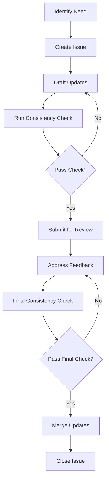

# Document Update Workflow

This workflow ensures consistent, high-quality updates to project documentation. It defines the process for identifying, implementing, reviewing, and finalizing documentation changes.

## Workflow Overview



## Detailed Process

### Step 1: Identify Documentation Needs

- Review the [gap analysis document](../traceability/gap_analysis.md)
- Check recent PRs for code changes requiring documentation updates
- Consider user feedback or reported documentation issues
- Identify specific sections or documents needing updates

**Deliverable**: Clear understanding of what needs to be updated and why

### Step 2: Create Documentation Issue

- Create a GitHub issue with the "documentation" label
- Include:
  - Documents to be updated
  - Specific sections requiring changes
  - Reference to relevant requirements (REQ-XXX-###)
  - Priority level (P0/P1/P2)
  - Proposed timeline

**Deliverable**: GitHub issue with detailed description

### Step 3: Draft Documentation Updates

- Create a branch for the documentation update
- Follow these naming conventions: `docs/brief-description`
- Update documents using the standard templates
- Include requirement IDs in the document metadata and relevant sections
- Update the document's version number and last updated date
- Update any related cross-references in other documents

**Deliverable**: Updated documentation in a feature branch

### Step 4: Run Initial Consistency Check

- Run the doc_consistency.py script:
  ```bash
  python docs/scripts/doc_consistency.py
  ```
- Review the consistency report for any issues
- Address all identified inconsistencies
- Update the traceability matrix if needed

**Deliverable**: Clean consistency report

### Step 5: Submit for Review

- Create a pull request with the documentation changes
- Reference the original issue in the PR description
- Request review from relevant team members based on the content:
  - Technical content: Request review from subject matter experts
  - Editorial content: Request review from documentation team
  - Process content: Request review from project manager

**Deliverable**: Pull request ready for review

### Step 6: Address Review Feedback

- Respond to all review comments
- Make requested changes as appropriate
- Document reasons for any declined suggestions
- Update the PR with the changes

**Deliverable**: Documentation updates addressing all review feedback

### Step 7: Final Consistency Check

- Run the doc_consistency.py script again after all changes
- Update the traceability matrix with any new or modified requirements
- Ensure all document cross-references are correct
- Check that document metadata is up to date

**Deliverable**: Final updated documentation that passes all consistency checks

### Step 8: Merge and Close

- Merge the approved PR into the main branch
- Close the original issue
- Update the documentation version history
- Communicate changes to the team as needed

**Deliverable**: Merged documentation updates

## Guidelines for Specific Document Types

### SRS Updates

- Ensure all new requirements have unique IDs
- Update the requirements traceability matrix
- Verify that acceptance criteria are clear and testable
- Cross-reference with project overview for consistency

### SDD Updates

- Include diagrams for architectural changes
- Ensure component interfaces are clearly defined
- Reference specific requirements being implemented
- Validate technical approach with development team

### API Documentation Updates

- Include request/response examples
- Document error codes and handling
- Update authentication requirements if changed
- Ensure backward compatibility or note breaking changes

### Test Plan Updates

- Align test cases with requirements
- Include acceptance criteria
- Define test data requirements
- Specify testing environments

## Review Checklist

Reviewers should check for:

- [ ] Adherence to documentation templates
- [ ] Correct requirement references
- [ ] Technical accuracy
- [ ] Clarity and readability
- [ ] Completeness (covers all aspects of the change)
- [ ] Consistency with other documents
- [ ] Up-to-date metadata (version, date, etc.)

## Tools and Resources

- Document Templates: [document_template.md](document_template.md)
- Review Template: [review_template.md](review_template.md)
- Consistency Checker: [doc_consistency.py](../scripts/doc_consistency.py)
- Traceability Matrix: [traceability_matrix.md](../traceability/traceability_matrix.md)

---

*This workflow will be reviewed and updated quarterly to incorporate process improvements and lessons learned.*